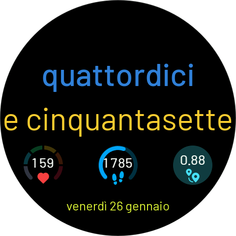

# TextWatch — the time, in words

A ZeppOS watchface that tells the time as written words, in your language.



Born as an Italian-only text watch, it now speaks **Italian, English, Spanish and Russian** — the language is picked automatically from the watch system language (English is the fallback).

| Language | Example (14:57) |
|----------|-----------------|
| 🇮🇹 Italiano | `due` / `e cinquantasette` |
| 🇬🇧 English  | `two` / `fifty-seven` |
| 🇪🇸 Español  | `dos` / `y cincuenta y siete` |
| 🇷🇺 Русский  | `два` / `и пятьдесят семь` |

Each language gets proper idiomatic forms, not literal translations: `mezzogiorno`/`noon`/`mediodía`/`полдень`, quarter hours (`e un quarto`, `y media`, `и четверть`…), Italian phonetic elisions (`ventotto`, `trentuno`), Russian genitive months in dates.

## Features

- **Time as words** — hours and minutes spelled out, with a smooth slide-in animation on every minute change
- **Localized date** — e.g. `venerdì 26 gennaio`, tap it to open the calendar
- **Always-on display** — dedicated thin-font layout
- **11 backgrounds** — 6 dark + 5 light, selectable in the watchface editor; widget text automatically switches to dark on light backgrounds
- **Per-zone colors** — hour, minute and date colors are independently customizable, with live localized previews in the editor
- **5 widget slots** — 4 on the bottom row + 1 top-center, each configurable from ~28 data widgets (or left empty); non-empty bottom slots re-space themselves automatically
- **Tap-to-open** — every widget opens its system app (heart rate, weather, alarm…)

### Available widgets

Heart rate, steps, calories, battery, distance, standing hours, PAI (daily arc or weekly bar chart), SpO2, stress, sleep, body/ambient temperature, weather, humidity, wind (speed + direction), UV index, moon phase, sun arc (sunrise/sunset with day-progress dial), BioCharge, VO2max, recovery time, training load, fat burn, altimeter, altitude, stopwatch, countdown, alarm.

## Supported devices

Round ZeppOS 3.0+ watches. Primary target is the **Amazfit Balance** (480×480); dedicated targets cover 466, 454, 416 and 360 px round screens.

## Building

Requires the [Zeus CLI](https://docs.zepp.com/docs/guides/tools/cli/):

```bash
npm i -g @zeppos/zeus-cli
zeus dev      # run in the simulator / preview on a paired watch
zeus build    # produce the installable package
```

## Project layout

```
watchface/
  index.js          # layout, animations, AOD, editor groups
  numberToText.js   # number → words engine (it / en / es / ru)
  colorSelector.js  # per-zone color pickers with localized previews
  editTypesUtil.js  # the ~28 data widgets renderers
  backgrounds.js    # background catalog (dark / light)
tools/              # Python generators for backgrounds and editor previews
assets/             # per-target images and fonts
```
